# Event Platform 🎟️

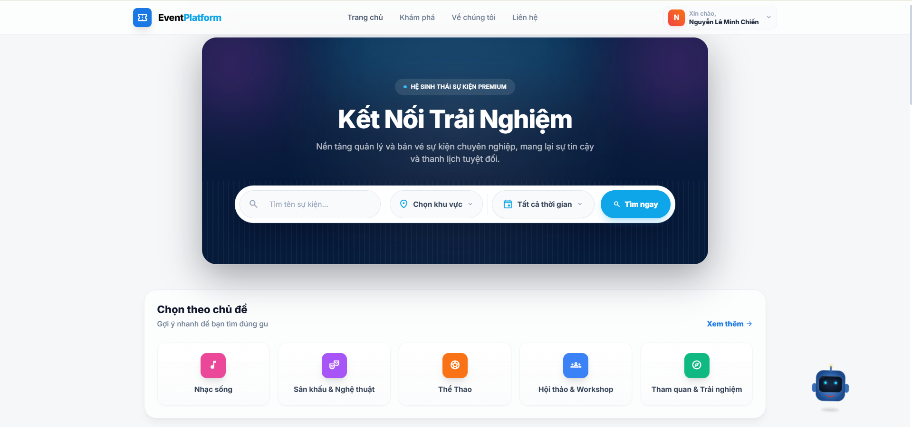

A comprehensive, modern Event Management and Ticketing Platform built with a microservices architecture. It allows users to browse events, select seats on an interactive map, make online payments, and even book tickets via an intelligent AI Chatbot.

---

## 🌟 Key Features

### 1. Browse & Search Events
Discover upcoming events, concerts, workshops, and sports matches with advanced filtering and search capabilities.
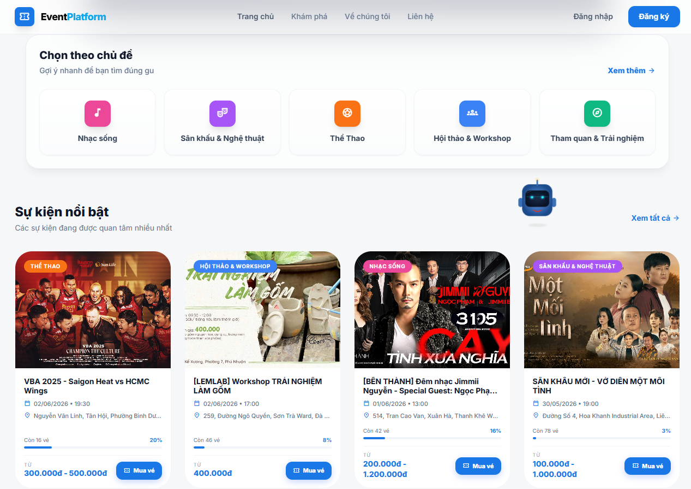
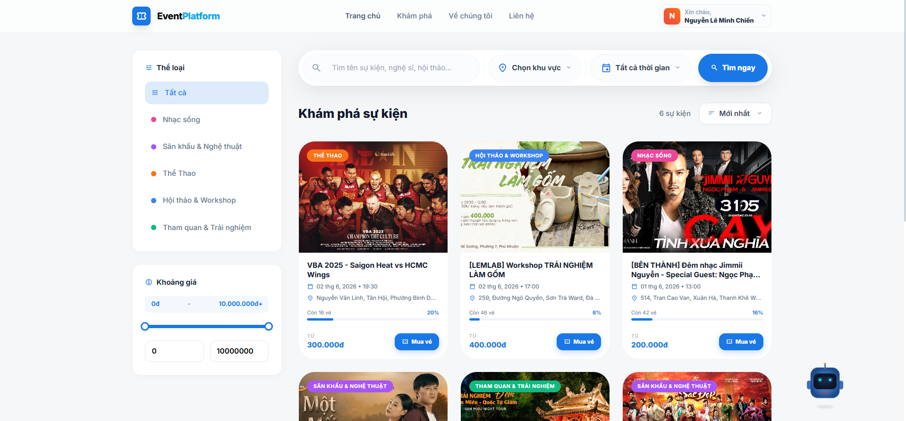

### 2. Event Details & Feedback
View detailed event information, schedules, and read user feedback.
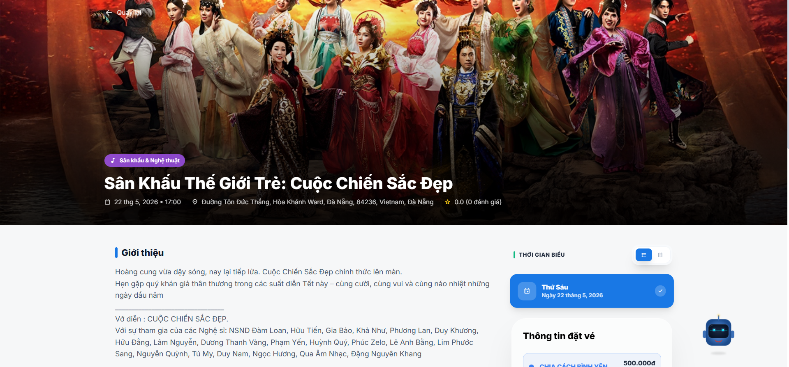
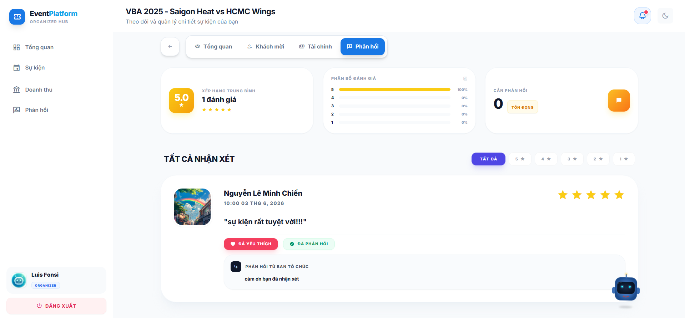

### 3. Interactive Seat Mapping & Ticketing
A visually rich, interactive seat map that allows users to pick their exact seats. Seat statuses are updated in real-time to prevent double bookings.
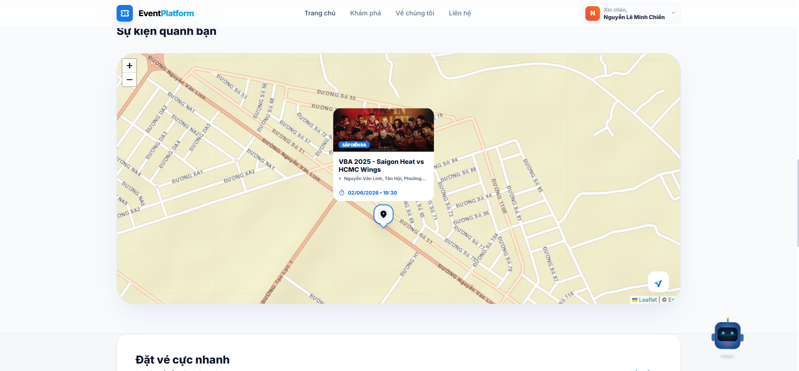
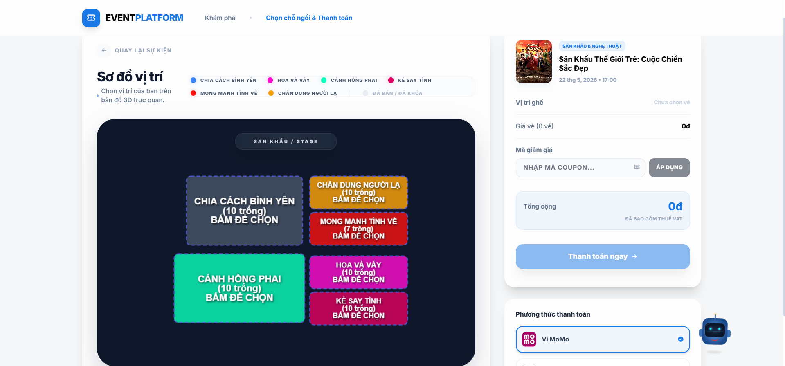

### 4. AI Assistant Chatbot 🤖
A dedicated AI-powered chatbot that understands natural language. Users can ask about upcoming events, ticket prices, and even initiate the booking process directly through the chat interface.
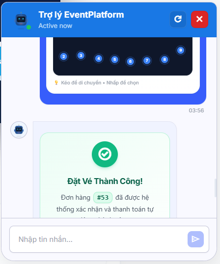

### 5. Discounts & Coupons
Apply coupons easily during the checkout process to receive special discounts.
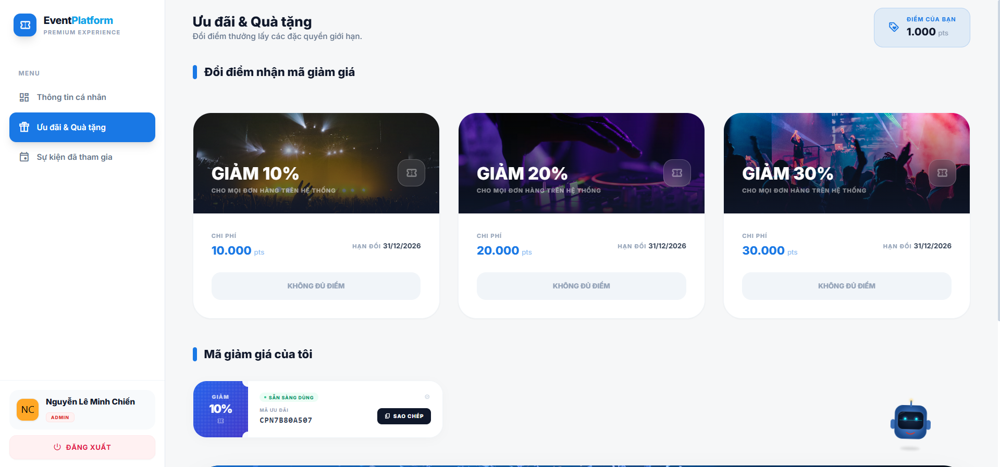

### 6. User Profile Management
Manage personal information, track booked tickets, and view purchase history.
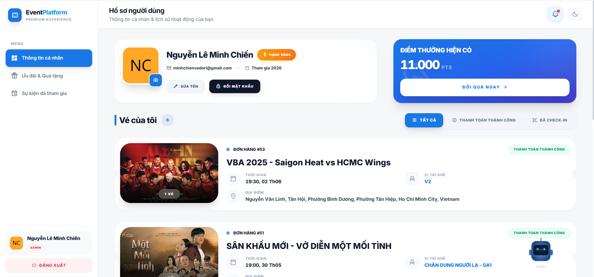

### 7. Organizer Dashboard
A dedicated portal for event organizers to create new events, manage ticket pricing, set up seat layouts, and track sales performance.
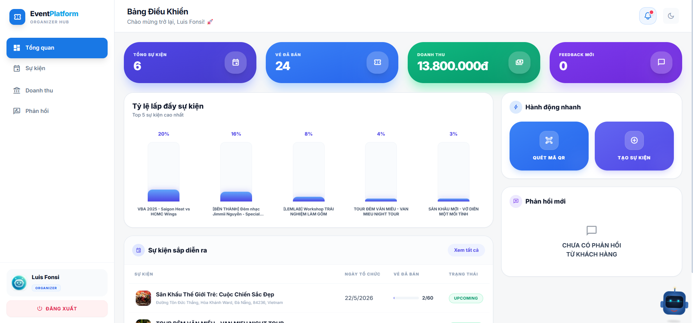
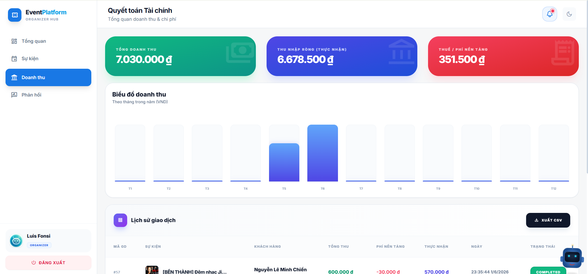

### 8. Admin Management
System administration portal to oversee users, events, and global financial metrics.
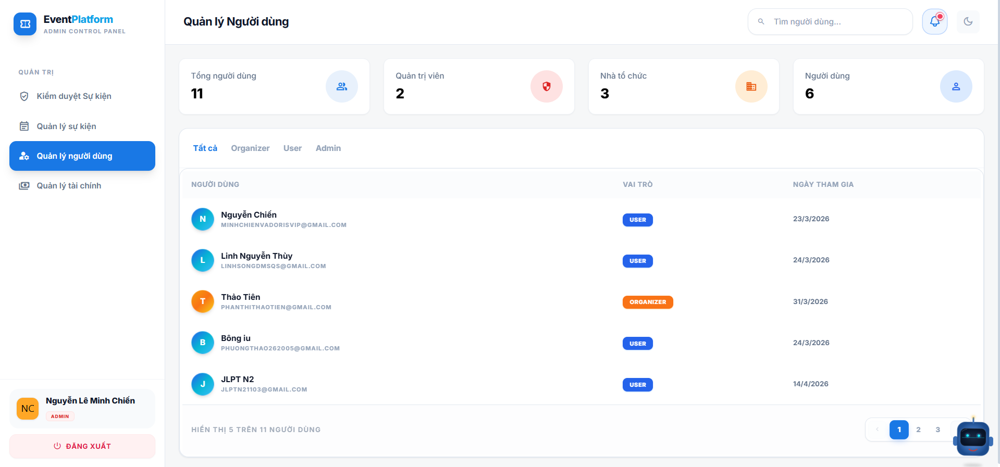
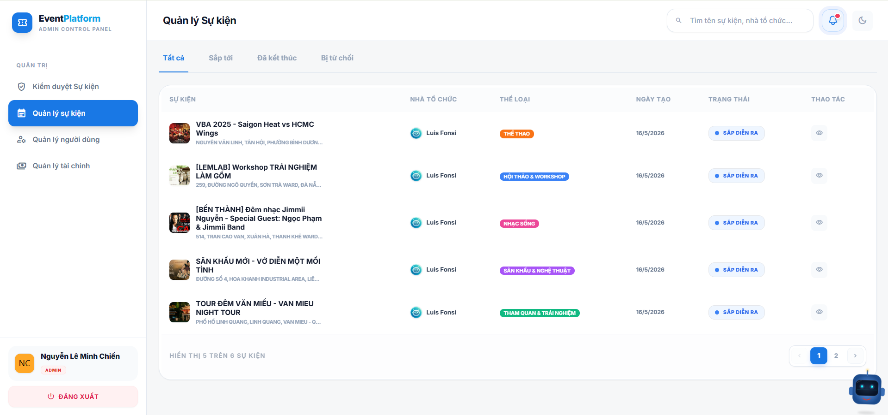
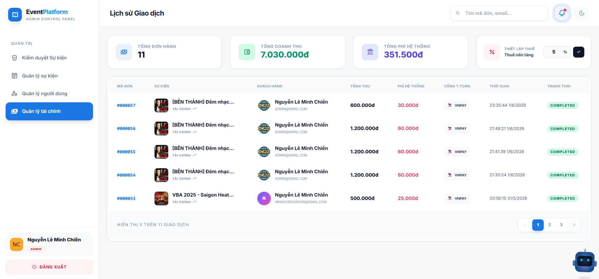

---

## 🏗️ Architecture & Tech Stack

This project is divided into three main services:

### 🎨 Frontend (Client)
- **Framework:** React 18 with Vite
- **Styling:** Tailwind CSS
- **State Management:** React Context / Hooks
- **Language:** TypeScript

### ⚙️ Backend (Core API)
- **Framework:** Java Spring Boot 3
- **Database:** PostgreSQL
- **ORM:** Spring Data JPA / Hibernate
- **Security:** Spring Security & JWT, OAuth2 (Google)
- **Features:** Payment Integration (MoMo, VNPay), Cloudinary for Image Hosting

### 🧠 AI Service (Chatbot)
- **Framework:** Python FastAPI
- **AI Core:** LangChain, Groq API (LLM)
- **Functionality:** Agentic Tool Calling, Semantic Search, Event Querying

---

## 🚀 Getting Started

### Prerequisites
- Node.js (v18+)
- Java 17+
- Python 3.12+
- PostgreSQL

### 1. Run the Backend (Spring Boot)
1. Navigate to the `backend` directory.
2. Update `application.yaml` with your PostgreSQL credentials and API Keys (Cloudinary, VNPay, MoMo).
3. Run the application:
```bash
cd backend
./mvnw spring-boot:run
```

### 2. Run the AI Service (FastAPI)
1. Navigate to the `AI` directory.
2. Install dependencies:
```bash
cd AI
pip install -r requirements.txt
```
3. Copy `.env.example` to `.env` and add your LLM API Keys (Groq) and `BACKEND_URL`.
4. Start the server:
```bash
uvicorn main:app --reload --port 8000
```

### 3. Run the Frontend (React/Vite)
1. Navigate to the `frontend` directory.
2. Install dependencies:
```bash
cd frontend
npm install
```
3. Update `.env` with your API URLs (`VITE_API_URL` and `VITE_CHATBOT_API_URL`).
4. Start the development server:
```bash
npm run dev
```

---

## 📦 Deployment
The application is container-ready. 
- Ensure all `.env` files and `application.yaml` configurations point to production URLs.
- Update `APP_CORS_ALLOWED_ORIGINS` in the Spring Boot backend to allow your production domain.
- Configure Google OAuth Client IDs with your production Redirect URIs.

---

## 📝 License
This project is licensed under the MIT License.
